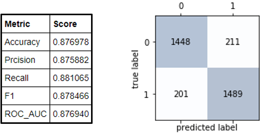
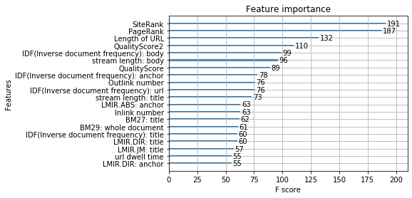
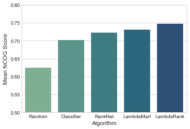
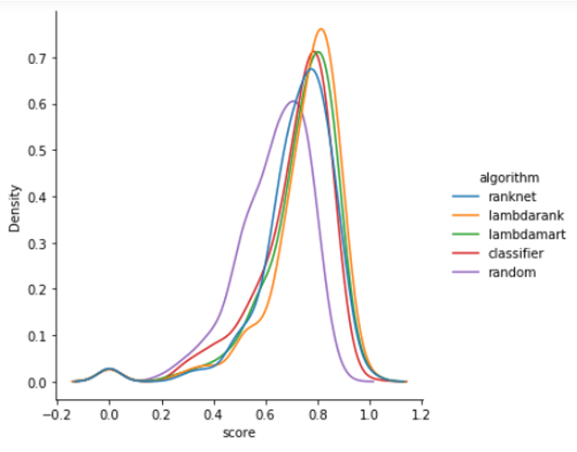

# learning_to_rank_in_python
An exploration of learning-to-rank machine learning approaches in Python

### Introduction

Learning to Rank (LTR) algorithms are an interesting and useful sub-branch of machine learning in which models are 
trained to rank items from most relevant to least relevant. In this notebook we are going to explore several of these algorithms and have some fun with an open source ranking benchmark dataset.

### Dataset and Techniques

I used an open source benchmark learning to rank dataset for this exploration of learning to rank algorithms. 
Microsoft Research gives this description of their open source MSLR-WEB10K dataset (https://www.microsoft.com/en-us/research/project/mslr/):

"The datasets consist of feature vectors extracted from query-url pairs along with relevance judgment labels. The relevance judgments are obtained from a retired labeling set of a commercial web search engine (Microsoft Bing), 
which take 5 values from 0 (irrelevant) to 4 (perfectly relevant). The features are basically extracted by us, and 
are those widely used in the research community. In the data files, each row corresponds to a query-url pair. The first 
column is relevance label of the pair, the second column is query id, and the following columns are features. 
The larger value the relevance label has, the more relevant the query-url pair is. A query-url pair is represented by a 
136-dimensional feature vector."

Take a look at a cleaned up version of the MSLR-WEB10K dataset in the data directory of this repo. I have used 
a data cleaning script from a tutorial on learning to rank given by Sophie Watson (https://devconfcz2019.sched.com/speaker/sophie174),
and then performed additional cleaning and enhancement with my own Python scripts.
Definitely check out Sophie Watson's talks and tutorial material on the learning to rank problem, her material was a big 
help in getting going with the MSLR-WEB10K dataset. 

I explore the performance of 5 algorithms in the two notebooks in this repository. 
Random Baseline. Classification Baseline. RankNet. LambdaRank. LamdaMart. NDCG: Normalized Discounted Cumulative Gain

### Results and Discussion

The notebook 'xgboost_document_relevance_classification.ipynb' attacks a simplified version of the learning to rank problem.
I extracted the query-url pairs that were irrelevant (label=0) and the query-url pairs that were perfectly relevant (label=4) and 
created a binary classification dataset. I trained a xgboost classifier to differentiate between the 'irrelevant' and 'perfectly relevant' 
classes and obtained the decent results below.

Note that these results have been obtained without hyperparameter tuning, a topic that will be covered in a future notebook. The 
feature importance scores were extracted from the boosted tree ensemble, the most important features visualized below.

The notebook 'ranking_with_python' contains the next phase of the study. Here we retain the full set of relevance scores (0 to 4) and
trained 3 popular algorithms for the learning to rank problem. For comparison, a random model that randomly assigned
a random score between 0 and 4 to each query-url pair in the test set. A baseline classification model was also trained and scored. 
The classifier was an xgboost model with the objective set to 'multi:softmax' to perform a multi-class classification (0 to 4). 

The models are assessed with the ranking metric Normalized Discounted Cumulative Gain (NDCG). You can read all about
NDCG here https://en.wikipedia.org/wiki/Discounted_cumulative_gain. We use the scikit-learn implementation of NDCG
(https://scikit-learn.org/stable/modules/generated/sklearn.metrics.ndcg_score.html).

We see that the 3 specialized ranking algorithms (RankNet, LambdaMart, LambdaRank) outperform both the random model
and the classification model. The xgboost classification model obtains decent results, not bad if in a pinch. It 
is somewhat surprising that LambdaRank outperformed LambdaMart, given the evolution of these algorithms with 
LambdaMart developing after LambdaRank. We will look into this in a later notebook.
You can read about the evolution of these three ranking algorithms in this paper, 

Burges, Christopher JC. "From ranknet to lambdarank to lambdamart: An overview." Learning 11.23-581 (2010): 81.

The table above just gives the average performance of the algorithms. More insight is 
gained by examining the distribution of scores characterized by quantiles of the 
empirical distributions of scores, and visualizing the shape of these distributions. 

### Conclusion

In summary, we found that the ranking algorithms achieve a mean NCDG score higher than both the random model and the 
classification model, but it is closer than you might expect. LambdaRank also does slightly better than LambdMart, 
which also warrants further investigation. The next steps here will be to explore hyperparameter settings and expand 
the model training to a larger fraction of the dataset, as we used only a portion of the
available dataset in these studies for efficiency. 