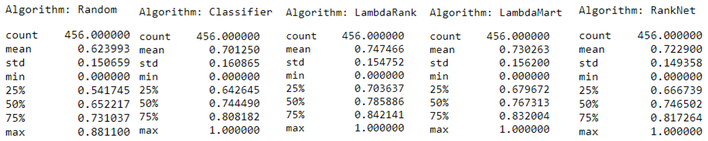

# learning_to_rank_in_python
An exploration of learning-to-rank machine learning approaches in Python

### Introduction

Learning to Rank (LTR) algorithms are an interesting and useful sub-branch of machine learning. In this notebook we are going to explore several of these algorithms and have some fun with an open source ranking benchmark dataset.

### Dataset and Techniques

I used an open source benchmark learning to rank dataset for this exploration of learning to rank algorithms. 
Microsoft Research gives this description of their open source MSLR-WEB10K dataset (https://www.microsoft.com/en-us/research/project/mslr/):

"The datasets consist of feature vectors extracted from query-url pairs along with relevance judgment labels.  
The relevance judgments are obtained from a retired labeling set of a commercial web search engine (Microsoft Bing), 
which take 5 values from 0 (irrelevant) to 4 (perfectly relevant). The features are basically extracted by us, and 
are those widely used in the research community. In the data files, each row corresponds to a query-url pair. The first 
column is relevance label of the pair, the second column is query id, and the following columns are features. 
The larger value the relevance label has, the more relevant the query-url pair is. A query-url pair is represented by a 
136-dimensional feature vector."

Take a look at a cleaned up version of the MSLR-WEB10K dataset in the data directory of this repo. I have used 
a data cleaning script from a tutorial on learning to rank given by Sophie Watson (https://devconfcz2019.sched.com/speaker/sophie174),
and then performed additional cleaning and enhancement with my own Python scripts.
Definitely check out Sophie Watson's talks and tutorial material on the learning to rank problem, her material was a big 
help in getting going with the MSLR-WEB10K dataset. 

I explore the performance of 5 algorithms in the two notebooks in this repository. 
Random Baseline. Classification Baseline. RankNet. LambdaRank. LamdaMart. NDCG: Normalized Discounted Cumulative Gain

### Results and Discussion

We found that the ranking algorithms achieve a mean NCDG score higher than both the random model and the classification model, but it is closer than you might expect. LambdaRank also does slightly better than LambdMart, which also warrants further investigation. The next steps here will be to explore hyperparameter settings and expand the model training to a larger fraction of the dataset.